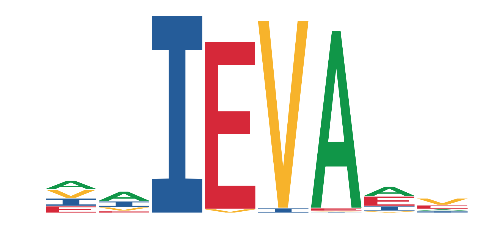

<h1 align="center"> Ieva Rauluseviciute </h1>

<h2 align="center"> PhD student</h2>

**Labas!** (*"Hi!"* in Lithuanian)

I am a PhD student in [Anthony Mathelier's Lab](https://mathelierlab.com/) at Center for Molecular Medicine Norway (NCMM), Oslo, Norway. I am studying gene regulation through transcription factor binding and loving it. I am using computational approaches, so I guess you can also call me a bioinformatician. 3000 years ago I was there, in a wetlab too :ring:. I studied Genetics for my bachelor, then Molecular medicine, where I switched to computational data analysis.

:scroll: **Personal website:** [ievarau.github.io](https://ievarau.github.io/)

:bird: **Twitter:** [@IevaRau](https://twitter.com/ievarau)

:mailbox: **E-mail:** ievarau@uio.no

